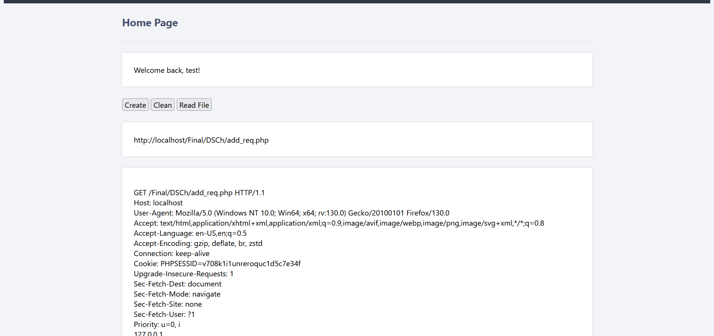

# Burp Collaborator
 

####a web base that create a path that if you send a http request to it 
####show request and ip 


# > ⌛️ Instalation

### > 💻 All

```bash
CREATE DATABASE phplogin;
USE sina;
CREATE TABLE accounts (
  username VARCHAR(255) NOT NULL PRIMARY KEY,
  password VARCHAR(255) NOT NULL
);
INSERT INTO accounts (user, password) VALUES ('<username>', '<password>'); 

```
```bash
1.copy above code and open mysql
2.change <username> and <password>
2.click at SQl 
3.past it 
4.click at Go
5.copy Files into your webserver 
6.login 
```
# > 📷 screenshots


